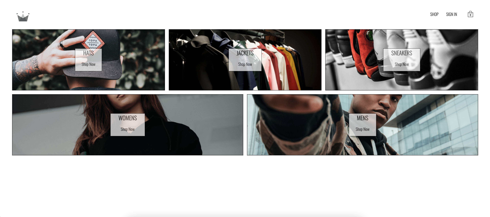
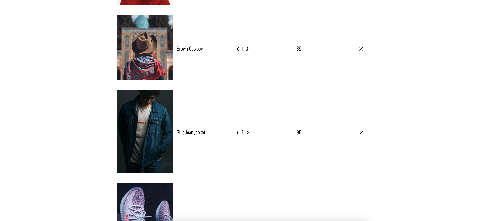
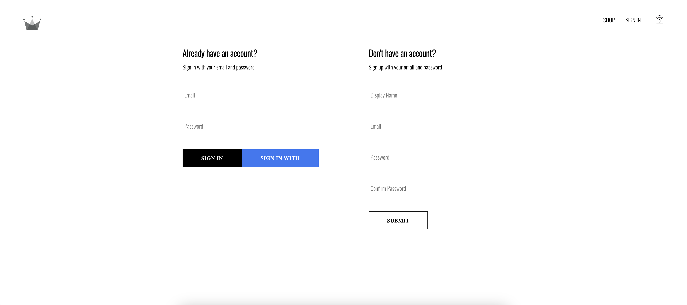

# Eco Merchant

  
  
  
  
  Eco Merchant is an ecommerce web application. Similar to your favorite clothing store's website. You can browse clothing, add them to your cart, and purchase them if you would like. Navigate through the site seamlessly and even sign up, so that you can receive updates as the catalogue get's updated from season to season.

  [React](https://reactjs.org/), [Node.js](https://nodejs.org/en/), [Sass](https://sass-lang.com/), [Redux](https://redux.js.org/) and [Firebase](https://firebase.google.com/) were used to create this application.

 The deployed site can be found [here](https://exquisite-basbousa-208df9.netlify.app/).

  &nbsp;
  # Table of Contents:
  * [Installation](#installation)
  * [Usage](#usage)
  * [Future Developments](#future)
  * [Questions](#questions)
  
---
&nbsp;
  ## Installation:
The application is deployed [here](https://exquisite-basbousa-208df9.netlify.app/)

  However, if you would like to clone to your local machine:
  &nbsp;
  1. `git clone` this repository or fork it over
  2. In the project's terminal, run `yarn` to install the dependencies
  3. To run the application, run `yarn start` in both repositories

&nbsp;
> Landing Page
 

&nbsp;
> Shop Page
 

&nbsp;
> Cart Interface
 

&nbsp;
> Cart Page
 

&nbsp;
> Category Page

&nbsp;
> Sign In Page

&nbsp;
  ## Future:
In a future development, Eco Merchant:
  
  * Will use AWS to store photos
  * Will allow users to upload their photos of the clothing
  * Will include a comment section for reviews
  * Offer suggestions for outfits

  &nbsp;
  ## Questions:
  If you need any further assistance, the contact information of the group members is below. Additionally, you may email blehjooo@gmail.com.

  #### Bleh Seton: 
  * Github: [blehjo](https://github.com/Blehjo)
